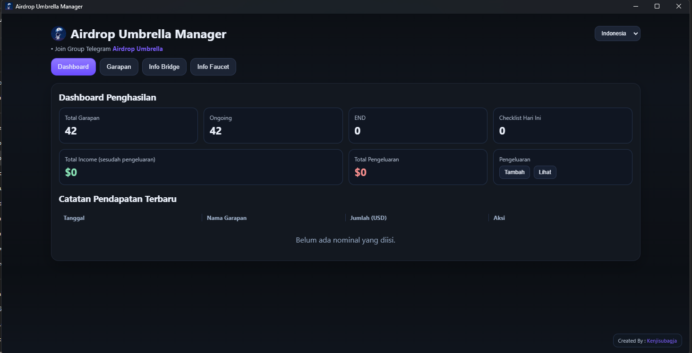
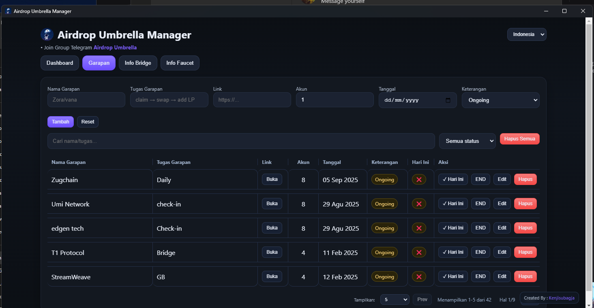
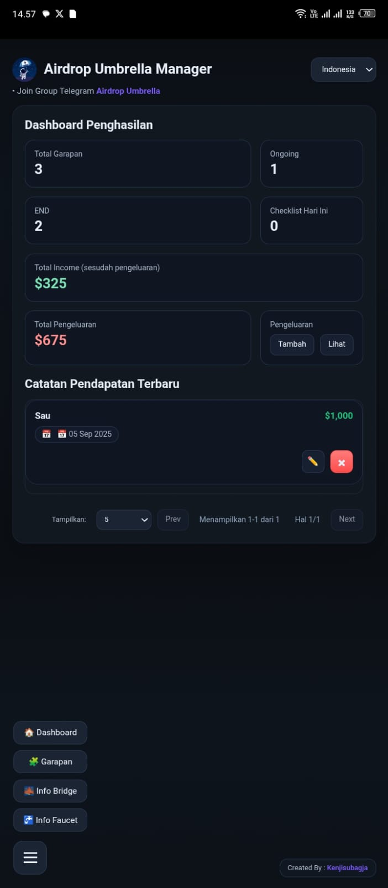
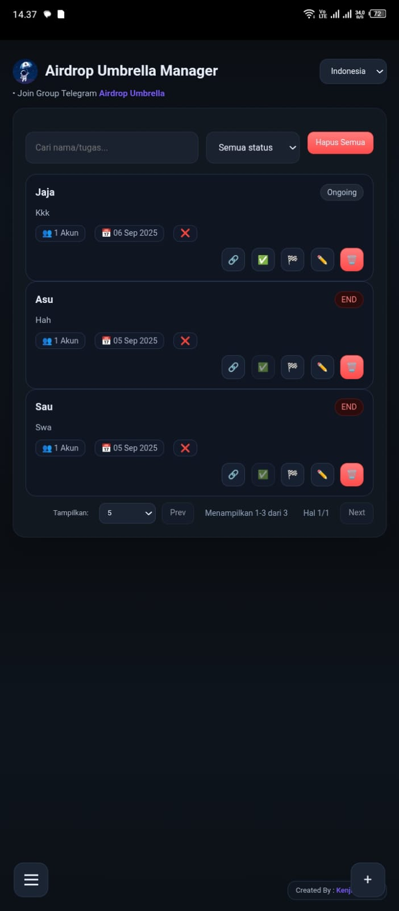

# 🌂 Airdrop Umbrella Manager v1.2.0

**Airdrop Umbrella Manager V1.2.0** adalah aplikasi yang update dari versi sebelum nya [V1.0.0](https://github.com/kenjisubagja/Airdrop-Umbrella-Manager) dan ambil: web/mobile/Desktop sederhana untuk mengelola aktivitas airdrop, pendapatan, bridge, faucet, dan pengeluaran.  
Didesain dengan tampilan **dark mode minimalis**, cocok digunakan langsung di-*install* sebagai aplikasi android atau desktop.

---

## ✨ Fitur Utama

- 📋 **Manajemen Garapan (Tasks)**
  - Tambah, edit, checklist harian, end task
- 💰 **Dashboard Penghasilan**
  - Statistik total task, ongoing, END, checklist harian
  - Perhitungan otomatis *income* dan *pengeluaran*
- 💵 **Catatan Pendapatan**
  - Simpan data income per project
- 🔗 **Info Bridge & Faucet**
  - Simpan daftar link bridge/faucet
  - Tombol **Buka** (untuk android dengan opsi pilih browser atau salin link dan untuk Desktop langsung di bawa ke chrome)
  - Tombol **Hapus** untuk manajemen
- 🌐 **Multibahasa**
  - Mendukung i18n (Indonesia, Sunda, Inggris)
- 📱 **Mobile Friendly**
  - Full responsive, ringan, bisa dipasang sebagai aplikasi

---

## 📸 Preview Desktop

### Dashboard

### Catatan Pendapatan

---
## 📸 Preview Android
### Dashboard

### Catatan Pendapatan

---

## 📦 Unduh aplikasi (Tinggal install tanpa mengahpus data lama kalian)
Masuk ke halaman **[Releases](https://github.com/kenjisubagja/Airdrop-Umbrella-Manager-v1.2.0/releases)** dan ambil:
- `Airdrop-Umbrella-Manager-Setup-1.2.0.exe` → **Installer** (disarankan)  
  Membuat **shortcut di Desktop & Start Menu** otomatis.
- `Airdrop-Umbrella-Manager-Portable-1.2.0.exe` → **Portable** (tanpa instal; **tidak** membuat shortcut otomatis).
- `Android-V1.2.0.apk` → ini buat user android note ya, pasti ada keterangan dari play protect, ijinkan aja, kalau pun di scan juga gpp kok
---
## 🔐 Data & Privasi
- Disimpan lokal (per-user, per-device) di folder data aplikasi.
- Tidak ada server, akun, atau telemetri.
- Uninstall akan menghapus data lokal aplikasi.
## Support buat aing biar gk malas 
[Traktir Cendol](https://trakteer.id/kenji_subagja/tip)
## Contact Me: 

